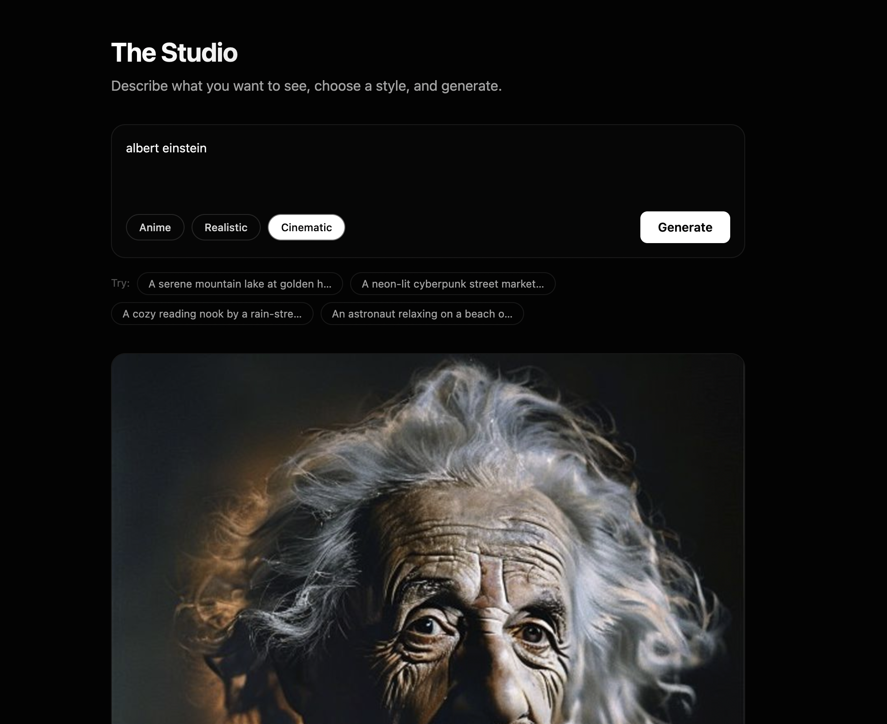

# 🎨 Eloura AI

## 📌 Overview

| Property | Value |
|----------|-------|
| **Project** | Eloura AI |
| **Type** | AI Image Generation SaaS |
| **Frontend** | React + Vite + TypeScript |
| **Backend** | Node.js + Express + TypeScript |
| **Database** | MongoDB Atlas |
| **Authentication** | JWT |
| **Payments** | Razorpay |
| **Deployment** | Vercel + Render |
| **Containerization** | Docker |
| **License** | MIT |

> **Production-grade AI Image Generation SaaS** built with a strict TypeScript MERN stack, featuring secure JWT authentication, AI-powered image generation, Razorpay payments, Cloudinary integration, Dockerized development, and cloud-native deployment.

<p align="center">

<a href="https://eloura-ai.vercel.app"></a> <a href="https://eloura-server.onrender.com/api/health"></a>

# 🌐 Live Deployment

## 🚀 Frontend

**https://eloura-ai.vercel.app**

## ⚙️ Backend API

**https://eloura-server.onrender.com**

## ❤️ Health Check

**https://eloura-server.onrender.com/api/health**

> **Note:** The backend is hosted on Render's free tier. After ~15 minutes of inactivity, the first request may take **30–60 seconds** while the service wakes up.

---

# ✨ Features

* ✅ Secure JWT Authentication (Signup/Login)
* ✅ Protected Routes
* ✅ AI Image Generation
* ✅ Multiple Generation Styles (Anime, Realistic, Cinematic)
* ✅ Credit-Based Usage Economy
* ✅ Razorpay Payment Gateway Integration
* ✅ Cryptographic Payment Signature Verification
* ✅ Persistent Image History
* ✅ Cloudinary CDN Image Storage
* ✅ Apple Intelligence-inspired User Interface
* ✅ Framer Motion Animations
* ✅ Responsive Design
* ✅ Strict TypeScript (`strict: true`)
* ✅ Dockerized Development Environment
* ✅ Production Deployment on Vercel + Render + MongoDB Atlas

---

# 🖼️ Application Walkthrough

## 🏠 Landing Page

### Hero Section

<p align="center">
  
</p>

### Features & Pricing

<p align="center">
  
</p>

---

## 🎨 AI Studio

### Studio Dashboard

<p align="center">
  
</p>

### Image Generation

<p align="center">
  
</p>

### Generated Result

<p align="center">
  
</p>

---

## 🖼️ Image History

<p align="center">
  
</p>

---

## 💳 Credit System

When credits reach zero, users are seamlessly redirected to the pricing page to purchase additional credits.

<p align="center">
  
</p>

---

## 💰 Razorpay Checkout Flow

### Payment Interface

<p align="center">
  
</p>

### Net Banking

<p align="center">
  
</p>

### Payment Successful

<p align="center">
  
</p>

### Credits Updated

<p align="center">
  
</p>

# 🏗️ System Architecture

```text
                          Users
                             │
                             ▼
                   Vercel (Frontend)
               React + Vite + TypeScript
                             │
                    HTTPS REST Requests
                             │
                             ▼
                 Render (Express Backend)
                Node.js + TypeScript API
                    │               │
                    │               ▼
                    │        MongoDB Atlas
                    │         (Database)
                    │
                    ▼
         Cloudinary CDN / OpenAI / Razorpay
```

---

# 🚀 Tech Stack

| Layer            | Technology                                              |
| ---------------- | ------------------------------------------------------- |
| Frontend         | React 18, Vite, TypeScript, Tailwind CSS, Framer Motion |
| Backend          | Node.js, Express, TypeScript                            |
| Database         | MongoDB Atlas, Mongoose                                 |
| Authentication   | JWT, bcrypt                                             |
| Payments         | Razorpay                                                |
| Image Storage    | Cloudinary                                              |
| Deployment       | Vercel, Render                                          |
| Containerization | Docker, Docker Compose                                  |

---

# 📂 Project Structure

```text
eloura-ai/
│
├── assets/
│   ├── Landing Page-1.png
│   ├── Landing Page-2.png
│   ├── Studio-1.png
│   ├── Studio-2.png
│   ├── Studio-3.png
│   ├── History Page.png
│   ├── Out of credits.png
│   ├── Payment Interface-1.png
│   ├── Net Banking.png
│   ├── Payment Successful.png
│   └── Credits Increment.png
│
├── client/
│   ├── src/
│   ├── Dockerfile
│   ├── Dockerfile.dev
│   └── nginx.conf
│
├── server/
│   ├── src/
│   ├── Dockerfile
│   └── package.json
│
├── docker-compose.yml
├── docker-compose.prod.yml
├── DEPLOYMENT.md
└── README.md
```

---

# ⚡ Quick Start

## Using Docker (Recommended)

```bash
git clone https://github.com/Tanmay130/Eloura-AI.git

cd Eloura-AI

cp .env.example .env

docker compose up --build
```

Frontend

```
http://localhost:5173
```

Backend

```
http://localhost:5000/api/health
```

---

## Without Docker

### Backend

```bash
cd server
npm install
npm run dev
```

### Frontend

```bash
cd client
npm install
npm run dev
```

---

# 🔐 Environment Variables

## Server

```env
NODE_ENV=production
PORT=5000

MONGO_URI=

JWT_SECRET=
JWT_EXPIRES_IN=7d

CLIENT_ORIGIN=

OPENAI_API_KEY=

CLOUDINARY_CLOUD_NAME=
CLOUDINARY_API_KEY=
CLOUDINARY_API_SECRET=

RAZORPAY_KEY_ID=
RAZORPAY_KEY_SECRET=
RAZORPAY_WEBHOOK_SECRET=
```

---

## Client

```env
VITE_API_BASE_URL=https://your-render-app.onrender.com
```

---

# 📡 REST API

## Authentication

```http
POST /api/auth/signup

POST /api/auth/login
```

---

## Images

```http
GET    /api/images

POST   /api/images/generate

DELETE /api/images/:id
```

---

## Payments

```http
POST /api/payments/order

POST /api/payments/verify
```

---

## Health

```http
GET /api/health
```

---

# 🚀 Production Deployment

| Component     | Platform      |
| ------------- | ------------- |
| Frontend      | Vercel        |
| Backend       | Render        |
| Database      | MongoDB Atlas |
| Image Storage | Cloudinary    |
| Payments      | Razorpay      |

---

# 💡 Why Eloura AI?

Eloura AI was built to demonstrate **production-ready full-stack engineering** practices. It combines secure authentication, AI-powered image generation, payment processing, cloud storage, RESTful API architecture, Docker containerization, and cloud-native deployment into a modern SaaS application.

The project emphasizes:

* Production-grade architecture
* Strict TypeScript across the entire stack
* Secure authentication and authorization
* Clean UI/UX with modern frontend practices
* Scalable backend design
* Real-world deployment on public cloud platforms

---

# 🌟 Project Highlights

* 🚀 Live Production Deployment
* 🔒 JWT Authentication
* 🎨 AI Image Generation
* 💳 Integrated Payment Gateway
* ☁️ Cloudinary CDN Storage
* 📦 Dockerized Development & Production
* ⚡ Strict TypeScript
* 📱 Fully Responsive Design
* 🎭 Framer Motion Animations
* 🌍 MongoDB Atlas Cloud Database
* 🔥 RESTful Express API
* ☁️ Cloud Deployment using Vercel & Render

---

# 📄 License

This project is licensed under the **MIT License**.

---

# 👨‍💻 Author

**Tanmay Singh Soni**

- GitHub: https://github.com/Tanmay130
- LinkedIn: https://linkedin.com/in/tanmay-singh-soni-b86733251

---

<p align="center">

⭐ If you found this project interesting, consider giving it a star!

</p>
